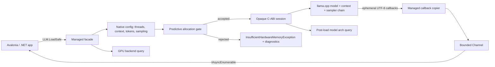

# CrashlessLLM Architecture

CrashlessLLM is a managed safety boundary for embedding local GGUF LLM inference inside .NET and Avalonia applications. Its job is not to hide `llama.cpp`; its job is to make the risky parts of native inference explicit, bounded, observable, and deterministic.

The public API is intentionally small:

```csharp
using var llm = LLM.LoadSafe("models/llama-3-8b.gguf");
await foreach (var token in llm.StreamAsync("Explain bounded backpressure."))
    Output.Text += token;
```

Everything below that surface is a stability contract: predict memory pressure before allocation, cross the native boundary through a versioned C ABI, stream tokens through bounded backpressure, and release native resources deterministically.

## System at a glance



## CrashlessLLM versus naive wrappers

| Concern | Naive native wrapper | CrashlessLLM |
| --- | --- | --- |
| Model admission | Calls native load and hopes allocation succeeds. | Computes a memory budget before load and rejects unsafe sessions synchronously. |
| Native memory visibility | The CLR cannot see model weights, context, sampler, KV cache, backend workspaces, or GPU/offload state. | Native telemetry is measured at the C boundary and surfaced as structured managed diagnostics. |
| Failure expression | OOM killer, `std::bad_alloc`, null native pointers, process termination, or frozen UI. | `InsufficientHardwareMemoryException` for predicted OOM; `NativeInferenceException` for deterministic ABI failures. |
| Token flow | Native callbacks push tokens at model speed regardless of UI consumption. | Bounded channel backpressure forces the native worker to wait when the consumer is behind. |
| UI responsiveness | Generation may run on or synchronously block the UI thread. | Generation runs on a native worker; the managed API exposes an async stream. |
| UTF-8 correctness | Token fragments are often marshalled as independent strings. | Bytes are copied immediately and accumulated until a valid UTF-8 string can be emitted. |
| Sampling control | Hardcoded greedy/random defaults or scattered native options. | `SamplingOptions` maps to a native sampler chain: greedy, temperature, top-k, top-p, min-p, distribution, repeat penalty, and seed. |
| Generation bounds | Token count is hardcoded or uncontrolled. | `LlmLoadOptions.MaxTokens` defaults to 512; `-1` means up to the remaining context window. |
| Chat prompting | Application code hand-rolls model-specific prompt formats. | `ChatTemplate` centralizes Llama 3, ChatML, Mistral, Gemma, and Phi formatting. |
| Lifetime management | Raw pointers, finalizer timing, or ad-hoc cleanup. | Opaque native session wrapped in `SafeLlmContextHandle` and released through `IDisposable`. |
| ABI stability | C++ types, exceptions, or layout-sensitive ownership semantics leak across the boundary. | Versioned C ABI with primitive parameters, opaque pointers, explicit error codes, and no C++ ownership crossing into .NET. |

## Layer 1: Managed facade and zero-config defaults

`LLM.LoadSafe(string path)` expands to safe defaults that bias toward keeping the host app responsive:

| Option | Default | Stability rationale |
| --- | ---: | --- |
| `Threads` | `max(1, Environment.ProcessorCount / 2)` | Leaves CPU headroom for UI, GC, compositor, and OS scheduling. |
| `ContextSize` | `4096` tokens | Avoids accidental large KV-cache allocations. |
| `GpuLayers` | `99` | Requests maximum native offload where supported while preserving caller override. |
| `MemorySafetyMargin` | `0.30` | Adds allocator, backend workspace, fragmentation, and OS variance headroom. |
| `MaxTokens` | `512` | Prevents runaway generations by default. |
| `Sampling` | `null` | Native defaults: temperature `1.0`, top-k `40`, top-p `0.95`, min-p `0.05`, repeat penalty disabled. |
| `ILogger` | `NullLogger.Instance` | Logging is opt-in and allocation-light by default. |

Production callers can override these values without bypassing the safety boundary:

```csharp
using var llm = LLM.LoadSafe("models/app-model.gguf", new LlmLoadOptions
{
    ContextSize = 2048,
    Threads = 4,
    GpuLayers = 0,
    MaxTokens = 512,
    MemorySafetyMargin = 0.20,
    Sampling = new SamplingOptions
    {
        Temperature = 0.7f,
        TopK = 40,
        TopP = 0.95f,
        MinP = 0.05f,
        RepeatPenalty = 1.1f,
        RepeatLastN = 64,
        Seed = 42
    }
}, logger);
```

## Layer 2: Predictive Allocation Gating

The highest-risk phase is model admission. Once the app crosses into native load, the CLR cannot reliably intercept every allocator failure or OS-level memory-pressure decision. CrashlessLLM therefore performs a preflight prediction before `llama_model_load_from_file` and `llama_init_from_model` are allowed to allocate.

### Pre-load heuristic

| Symbol | Meaning | Current implementation |
| --- | --- | --- |
| `W` | GGUF model file size in bytes | `stat` / `_stat64` on the requested model path |
| `C` | Requested context size in tokens | `LlmLoadOptions.ContextSize`, default `4096` |
| `D` | Conservative KV-cache density per token | `131,072` bytes/token (`128 KiB`) |
| `K` | Estimated KV cache bytes | `C × D` |
| `B` | Predicted base native footprint | `W + K` |
| `r` | Safety margin fraction | default `0.30` |
| `M` | Safety margin bytes | `floor(B × r)` |
| `P` | Predicted total bytes | `B + M` |
| `A` | Available physical memory | Platform telemetry |

Admission rule:

```text
K = C × 131,072
B = W + K
M = floor(B × r)
P = B + M

allow load if A is unavailable, otherwise require P <= A
```

If available-memory telemetry is unavailable (`A = 0`), CrashlessLLM bypasses the gate rather than permanently blocking unsupported platforms. On supported targets, unsafe loads are rejected with `ERR_INSUFFICIENT_MEMORY_PREDICTED`, mapped to `InsufficientHardwareMemoryException`.

### Example budget

For a 4 GiB GGUF model with the default 4096-token context:

| Term | Calculation | Result |
| --- | ---: | ---: |
| Model bytes `W` | `4 × 1024³` | `4,294,967,296` bytes |
| KV estimate `K` | `4096 × 131,072` | `536,870,912` bytes |
| Base `B` | `W + K` | `4,831,838,208` bytes |
| Safety margin `M` | `floor(B × 0.30)` | `1,449,551,462` bytes |
| Predicted total `P` | `B + M` | `6,281,389,670` bytes (`≈ 5.85 GiB`) |

The gate admits the model only when available physical memory is at least the predicted total. Otherwise the managed caller receives diagnostics before native allocation begins.

### Platform memory telemetry

| Platform | Available-memory source | Notes |
| --- | --- | --- |
| Windows | `GlobalMemoryStatusEx().ullAvailPhys` | Uses OS-reported available physical memory. |
| macOS | `host_statistics64` plus page size from `sysctl` | Counts `free_count + inactive_count + speculative_count`; excludes wired kernel memory. |
| Linux / Android | `sysconf(_SC_AVPHYS_PAGES) × sysconf(_SC_PAGE_SIZE)` | Uses available physical pages reported by the kernel. |
| Other | unavailable (`0`) | Gate bypasses to avoid false permanent rejection on unknown platforms. |

## Layer 3: Accurate post-load model introspection

The pre-load gate is deliberately conservative because it must operate before `llama.cpp` has parsed the model architecture. After a session is safely loaded, CrashlessLLM exposes `LLMSession.QueryModelArchInfo()` for accurate model reporting.

| Field | Source / meaning |
| --- | --- |
| `NLayer` | `llama_model_n_layer(model)` |
| `NEmbd` | `llama_model_n_embd(model)` |
| `NHead` | `llama_model_n_head(model)` |
| `NHeadKv` | `llama_model_n_head_kv(model)` |
| `NCtxTrain` | `llama_model_n_ctx_train(model)` |
| `BytesPerTokenKv` | Accurate post-load KV bytes per generated token |

Post-load KV formula:

```text
n_embd_head = n_embd / n_head
BytesPerTokenKv = 2 × n_layer × n_embd_head × n_head_kv × sizeof(float)
```

The leading `2` accounts for K and V cache tensors. This value is not used to bypass the pre-load safety gate; it exists for diagnostics, UI reporting, and explaining why a model behaves differently from the conservative admission heuristic.

## Layer 4: Versioned C-ABI boundary

CrashlessLLM uses a flat C ABI between .NET and the native safety core. The boundary is designed for P/Invoke, NativeAOT compatibility, deterministic failure mapping, and predictable ownership.

| Native export | Managed role | Boundary rule |
| --- | --- | --- |
| `crashless_get_api_version()` | Verifies ABI version before session creation. | Managed code rejects anything other than version `1`. |
| `crashless_v1_create_config(...)` | Allocates opaque native configuration. | Returns an error code and `void*`; no C++ type crosses the ABI. |
| `crashless_v1_config_set_context_size(...)` | Applies optional context override. | Primitive `int`; invalid values return `ERR_INVALID_POINTER`. |
| `crashless_v1_config_set_memory_margin(...)` | Applies optional memory margin override. | Primitive `double`; native code clamps invalid negative/non-finite margins. |
| `crashless_v1_config_set_sampling_params(...)` | Applies sampling controls. | Blittable struct with sentinel values for native defaults. |
| `crashless_v1_config_set_n_predict(...)` | Applies max-token limit. | `512` default; `-1` permits remaining-context generation. |
| `crashless_v1_load_model_safe_ex(...)` | Runs predictive gate and loads model/context. | Outputs opaque model context and load diagnostics. |
| `crashless_v1_generate_async(...)` | Starts generation on a native worker thread. | Returns immediately; tokens arrive through a synchronous callback. |
| `crashless_v1_cancel_generation(...)` | Requests cooperative cancellation. | Sets native cancellation state without throwing across the ABI. |
| `crashless_v1_free_session_secure(...)` | Releases sampler, context, model, worker state, and session container. | Cleanup failures never escape the C boundary. |
| `crashless_v1_query_gpu_backends()` | Reports compile-time backend support. | Returns a bitmask mapped to `GpuBackend`. |
| `crashless_v1_query_model_arch_info(...)` | Reports post-load model architecture. | Outputs a blittable struct; failure returns an explicit error code. |

Error-code mapping is explicit:

| Native code | Managed exception | Meaning |
| ---: | --- | --- |
| `0` | none | Success. |
| `-1` | `NativeInferenceException` | Invalid pointer or invalid ABI argument. |
| `-100` | `InsufficientHardwareMemoryException` | Predictive gate rejected the model. |
| `-101` | `NativeInferenceException` | `llama.cpp` rejected the model or failed to create context. |
| `-102` | `NativeInferenceException` | Native safety core trapped an internal exception. |
| `-103` | `NativeInferenceException` | Worker thread creation failed. |
| `-104` | `NativeInferenceException` | A generation is already active for this session. |

## Layer 5: Native sampler-chain construction

`SamplingOptions` is translated into a small, explicit native configuration struct. Sentinel values mean "use the native default" rather than forcing every caller to understand the full sampling chain.

| Managed option | Native sentinel | Behavior |
| --- | --- | --- |
| `Temperature` | `< 0` | Default temperature `1.0`; `0` selects greedy decoding. |
| `TopK` | `<= 0` | Default `40`; `1` behaves like top-1 sampling. |
| `TopP` | `< 0` | Default `0.95`. |
| `MinP` | `< 0` | Default `0.05`. |
| `RepeatPenalty` | `< 0` | Default `1.0`; values other than `1.0` enable repeat penalty. |
| `RepeatLastN` | `<= 0` | Defaults to `64`. |
| `Seed` | `0` | Native random seed behavior. |

The native worker constructs either a greedy sampler (`Temperature = 0`) or a temperature-based sampler chain with top-k, top-p, min-p, distribution sampling, and optional repeat penalty.

## Layer 6: Chat template formatting

CrashlessLLM keeps model-specific chat formatting out of UI code with `ChatMessage` and `ChatTemplate`.

| Template | Intended model families | Terminators / framing |
| --- | --- | --- |
| `ChatTemplate.Llama3` | Llama 3 / 3.1 / 3.2 instruct | `<|begin_of_text|>`, role headers, `<|eot_id|>` |
| `ChatTemplate.ChatML` | Qwen, DeepSeek, Yi, and ChatML-compatible models | `<|im_start|>role`, `<|im_end|>` |
| `ChatTemplate.Mistral` | Mistral / Mixtral instruct | `<s>[INST] ... [/INST]` |
| `ChatTemplate.Gemma` | Gemma instruct | `<start_of_turn>user/model` blocks |
| `ChatTemplate.Phi` | Phi-3 / Phi-4 chat | `<|system|>`, `<|user|>`, `<|assistant|>`, `<|end|>` |

These helpers do not tokenize or validate model compatibility. They produce prompt strings that can be passed directly to `StreamAsync()`.

## Layer 7: GC-safe streaming and UTF-8 reconstruction

Native generation emits `const char*` token pieces through an ephemeral callback. The pointer is valid only during the callback invocation, so managed code must never store it. CrashlessLLM copies bytes immediately, then reconstructs strings using strict UTF-8 decoding.

| Step | Mechanism | Stability benefit |
| --- | --- | --- |
| Pin callback delegate | `NativeMethods.TokenCallback` is stored for the session lifetime. | Prevents GC from collecting the reverse P/Invoke target while native generation is active. |
| Copy bytes immediately | Callback walks the null-terminated UTF-8 buffer into managed storage. | Avoids retaining ephemeral native memory. |
| Accumulate fragments | Incomplete multi-byte sequences remain buffered. | Prevents replacement characters or split Unicode tokens during streaming. |
| Emit valid strings | Strict decoder emits only complete UTF-8; final flush uses lenient decoding at stream end. | Keeps UI output stable even when token boundaries split code points. |
| Never throw across callback | Callback catches exceptions, completes the channel, logs failures, and requests cancellation. | Prevents managed exceptions from escaping into unmanaged code. |

## Layer 8: Bounded backpressure and UI safety

CrashlessLLM uses `Channel.CreateBounded<string>` with a capacity of 50 and `BoundedChannelFullMode.Wait`.

| Component | Behavior |
| --- | --- |
| Native worker | Runs generation away from the caller thread. |
| Reverse callback | Copies token bytes and writes decoded tokens into the channel. |
| Bounded channel | Holds at most 50 tokens ahead of the consumer. |
| Backpressure point | If full, the callback waits synchronously on the native worker thread. |
| UI consumer | Uses `await foreach` over `IAsyncEnumerable<string>` and paints at its own pace. |

This is the core pressure valve: the model is not allowed to outrun the UI indefinitely, and the UI is not asked to block waiting for native inference to finish.

## Layer 9: Deterministic ownership and concurrency model

Native inference sessions are expensive and must be released in a predictable order. CrashlessLLM uses `SafeLlmContextHandle` and `LLMSession.Dispose()` to enforce deterministic cleanup.

| Resource | Owner | Release path |
| --- | --- | --- |
| `llama_sampler*` | Native session container | Freed before context/model teardown. |
| `llama_context*` | Native session container | Freed after sampler. |
| `llama_model*` | Native session container | Freed after context. |
| Native worker state | Native session container | Cancelled before handle disposal; self-disposal uses deferred cleanup to avoid worker-thread join deadlocks. |
| Managed callback delegate | `LLMSession` | Retained until disposal to prevent premature GC. |
| Opaque handle | `SafeLlmContextHandle` | Released deterministically by `Dispose`, with SafeHandle fallback. |

Concurrency rule:

| Pattern | Supported | Reason |
| --- | --- | --- |
| Multiple active streams on one `LLMSession` | No | One native context/session has one generation gate. |
| Multiple `LLMSession` instances in parallel | Yes | Each session owns its own native model/context pair and worker state. |

## Layer 10: Observability, CI, and publication

| Capability | Implementation |
| --- | --- |
| Structured logging | `LLMSession` accepts `ILogger`, logs lifecycle and generation events, and falls back to `NullLogger.Instance`. |
| GPU backend detection | `LLM.QueryGpuBackends()` maps native compile-time `GGML_USE_*` flags to `GpuBackend` values: Metal, CUDA, Vulkan, ROCm, SYCL. |
| Stress coverage | Deterministic native shim validates UTF-8 fragmentation, backpressure, rapid lifecycle, predictive OOM mapping, UI starvation resistance, sampling config, max tokens, model architecture query, GPU query, and chat templates. |
| Native CI | GitHub Actions builds native artifacts for macOS arm64/x64, Linux x64/arm64, and Windows x64. |
| NuGet publication | `scripts/publish-nuget.sh` builds, tests, packs, verifies package contents, and pushes to NuGet.org or a custom feed. |

## Architectural boundaries and non-goals

| Topic | Position |
| --- | --- |
| Crash resistance | CrashlessLLM prevents predictable memory-admission crashes and managed/native streaming hazards. It is not a kernel sandbox. |
| Model trust | Do not load untrusted GGUF files; parser vulnerabilities belong below this boundary. |
| Exact pre-load memory proof | The admission heuristic is conservative, not a formal model of every backend allocator. It intentionally favors rejecting risky loads. |
| Accurate post-load reporting | `QueryModelArchInfo()` is accurate after a model is loaded; it does not replace the pre-load gate. |
| Remote inference | The architecture is for local native GGUF inference, not Ollama, REST APIs, or cloud model hosts. |
| Parallel generation | Use one active stream per `LLMSession`; create multiple sessions for parallel work. |

## Summary

CrashlessLLM turns local LLM embedding from an unmanaged allocation gamble into an explicit stability contract:

1. Predict native memory pressure before allocating.
2. Cross the FFI boundary through a flat, versioned C ABI.
3. Configure sampling and generation limits without exposing C++ state.
4. Copy ephemeral native token bytes immediately.
5. Reconstruct UTF-8 safely.
6. Apply bounded backpressure at the native worker, not the UI thread.
7. Report GPU backends and post-load model architecture explicitly.
8. Release native resources deterministically.

The result is a small public API over a deliberately strict boundary: three lines for the app developer, explicit failure for unsafe hardware conditions, observable native behavior, and smooth token flow for Avalonia interfaces.
